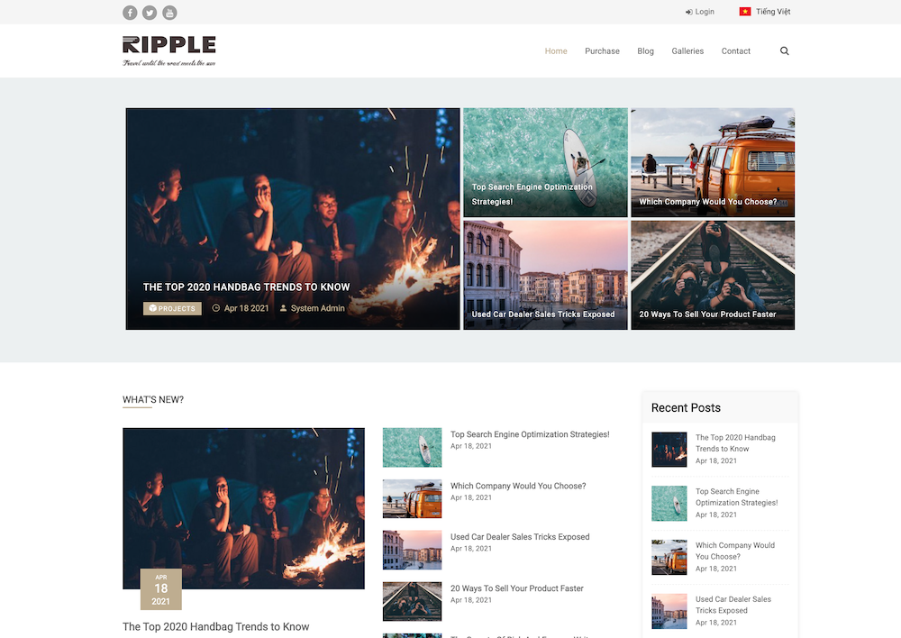

# THEME - ThemPhim - VSPHIM CMS

## Demo
### Trang Chủ


## Requirements
- Laravel Framework: ^6|^7|^8
- PHP: ^7.3|^8.0
- [vsphim/vsphim-core](https://github.com/vsphim/vsphim-core): ^1.0.0

## Install
1. Tại thư mục của Project: `composer require vsphim/theme-themphim`
2. Kích hoạt giao diện trong Admin Panel

## Update
1. Tại thư mục của Project: `composer update vsphim/theme-themphim`
2. Re-Activate giao diện trong Admin Panel

## Document
### List
- Trang chủ: `display_label|display_description|relation|find_by_field|value|sort_by_field|sort_algo|limit|show_more_url|template`
    ```
    🔥 Top phim|Những phim được xem nhiều nhất||is_copyright|0|view_total|desc|10|#|top
    Phim mới|Phim mới ra||is_copyright|0|updated_at|desc|14|/danh-sach/phim-moi|list
    ```

### Custom View Blade
- File blade gốc trong Package: `/vendor/vsphim/theme-themphim/resources/views/themethemphim`
- Copy file cần custom đến: `/resources/views/vendor/themes/themethemphim`

